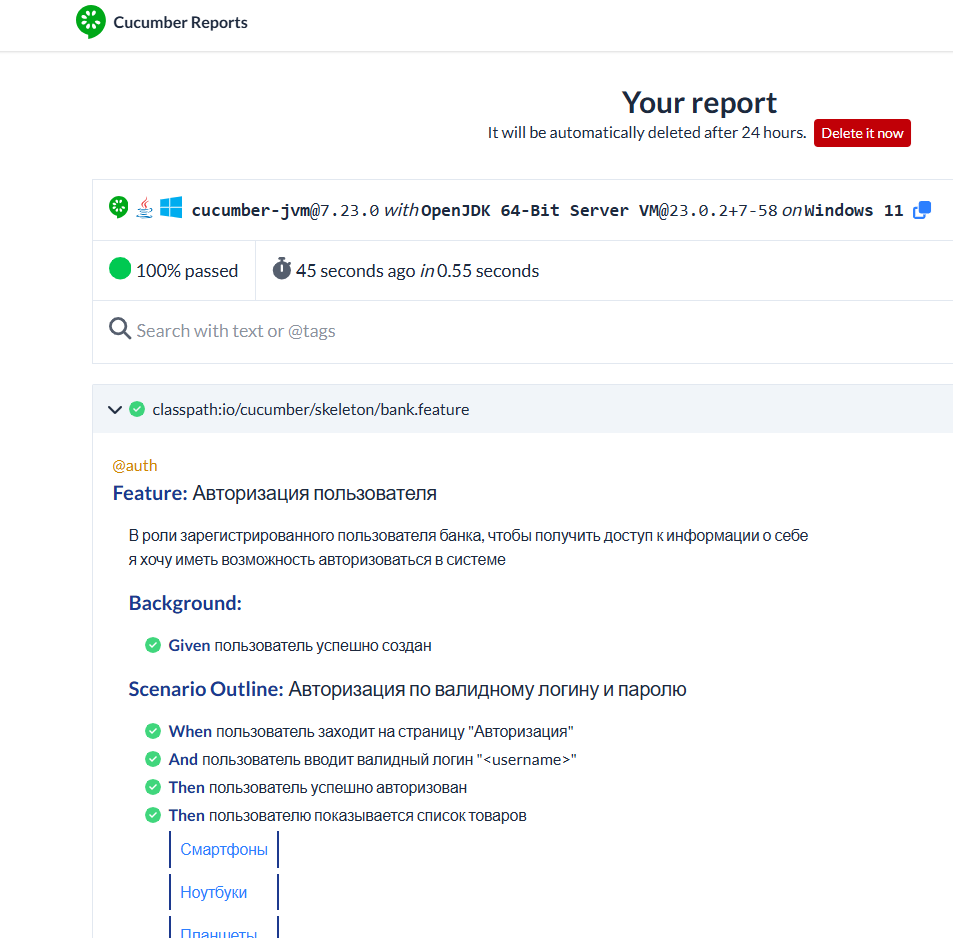

# $${\color{#ff0048}Cucumber \space \color{#00f0ec}Test \space \color{Magenta}Project}$$

## Описание 
:rocket: **После интеграции Cucumber в наш проект, мы смогли его протестировать с использованием написанных тестов.**
 
:rocket: **После проверки тестов, отчет отправляется на сервер Cucumber.**
 

## Использованные технологии
:white_check_mark:   JAVA
:white_check_mark:   Cucumber
## Установка 
**Склонируйте репозиторий и запустите тесты в разделе Test через редактор кода (IntelliJ IDEA)**
 
**После проверки тестов, отчет отправляется на сервер Cucumber**
 
:black_square_button: :black_square_button: :black_square_button:

